# ALBERT: A LITE BERT FOR SELF-SUPERVISED LEARNING OF LANGUAGE REPRESENTATIONS
# Abstract
Increasing model size when pretraining natural language representations often results in improved performance on downstream tasks. However, at some point further model increases become harder due to GPU/TPU memory limitations and longer training times. To address these problems, we present two parameter-reduction techniques to lower memory consumption and increase the training speed of BERT (Devlin et al., 2019). Comprehensive empirical evidence shows that our proposed methods lead to models that scale much better compared to the original BERT. We also use a self-supervised loss that focuses on modeling inter-sentence coherence, and show it consistently helps downstream tasks with multi-sentence inputs. As a result, our best model establishes new state-of-the-art results on the GLUE, RACE, and SQuAD benchmarks while having fewer parameters compared to BERT-large. 

# 1. Introduction
ALBERT incorporates two parameter reduction techniques that lift the major obstacles in scaling pre-trained models. The first one is a factorized embedding parameterization. By decomposing the large vocabulary embedding matrix into two small matrices, we separate the size of the hidden layers from the size of vocabulary embedding. This separation makes it easier to grow the hidden size without significantly increasing the parameter size of the vocabulary embeddings. The second technique is cross-layer parameter sharing. This technique prevents the parameter from growing with the depth of the network. Both techniques significantly reduce the number of parameters for BERT without seriously hurting performance, thus improving parameter-efficiency. An ALBERT configuration similar to BERT-large has 18x fewer parameters and can be trained about 1.7x faster. The parameter reduction techniques also act as a form of regularization that stabilizes the training and helps with generalization.

To further improve the performance of ALBERT, we also introduce a self-supervised loss for sentence-order prediction (SOP). SOP primary focuses on inter-sentence coherence and is designed to address the ineffectiveness (Yang et al., 2019; Liu et al., 2019) of the next sentence prediction(NSP) loss proposed in the original BERT.

As a result of these design decisions, we are able to scale up to much larger ALBERT configurations that still have fewer parameters than BERT-large but achieve significantly better performance. We establish new state-of-the-art results on the well-known GLUE, SQuAD, and RACE benchmarks for natural language understanding. Specifically, we push the RACE accuracy to 89.4%, the GLUE benchmark to 89.4, and the F1 score of SQuAD 2.0 to 92.2.

# 3. The Architecture Choices
## 3.1 Model Architecture Choices
The backbone of the ALBERT architecture is similar to BERT in that it uses a transformer encoder (Vaswani et al., 2017) with GELU nonlinearities (Hendrycks & Gimpel, 2016). We follow the BERT notation conventions and denote the vocabulary embedding size as E, the number of encoder layers as L, and the hidden size as H. Following Devlin et al. (2019), we set the feed-forward/filter size to be 4Hand the number of attention heads to be H/64.

There are three main contributions that ALBERT makes over the design choices of BERT.

**Factorized embedding parameterization.**  In BERT, as well as subsequent modeling improvements such as XLNet (Yang et al., 2019) and RoBERTa (Liu et al., 2019), the WordPiece embedding size Eis tied with the hidden layer size H, i.e., E $\equiv$ H. This decision appears suboptimal for both modeling and practical reasons, as follows.

For ALBERT we use a factorization of the embedding parameters, decomposing them into two smaller matrices. Instead of projecting the one-hot vectors directly into the hidden space of size H, we first project them into a lower dimensional embedding space of size E, and then project it to the hidden space. By using this decomposition, we reduce the embedding parameters from O(V $\times$ H) to O(V $\times$ E + E $\times$ H). This parameter reduction is significant when H $\gg$ E.

**Cross-layer parameter sharing.**  For ALBERT, we propose cross-layer parameter sharing as another way to improve parameter efficiency. There are multiple ways to share parameters, e.g., only sharing feed-forward network (FFN) parameters across layers, or only sharing attention parameters. The default decision for ALBERT is to share all parameters across layers. All our experiments use this default decision unless otherwise specified.

**Inter-sentence coherence loss.** In addition to the masked language modeling (MLM) loss (Devlin et al., 2019), BERT uses an additional loss called next-sentence prediction (NSP). NSP is a binary classification loss for predicting whether two segments appear consecutively in the original text, as follows: positive examples are created by taking consecutive segments from the training corpus; negative examples are created by pairing segments from different documents; positive and negative examples are sampled with equal probability.

We conjecture that the main reason behind NSP’s ineffectiveness is its lack of difficulty as a task, as compared to MLM. As formulated, NSP conflates topic prediction and coherence prediction in a single task. However, topic prediction is easier to learn compared to coherence prediction, and also overlaps more with what is learned using the MLM loss.

We maintain that inter-sentence modeling is an important aspect of language understanding, but we propose a loss based primarily on coherence. That is, for ALBERT, we use a sentence-order prediction (SOP) loss, which avoids topic prediction and instead focuses on modeling inter-sentence coherence. The SOP loss uses as positive examples the same technique as BERT (two consecutive segments from the same document), and as negative examples the same two consecutive segments but with their order swapped. This forces the model to learn finer-grained distinctions about discourse-level coherence properties.

## 3.2 Model Setup
Due to the design choices discussed above, ALBERT models have much smaller parameter size compared to corresponding BERT models.

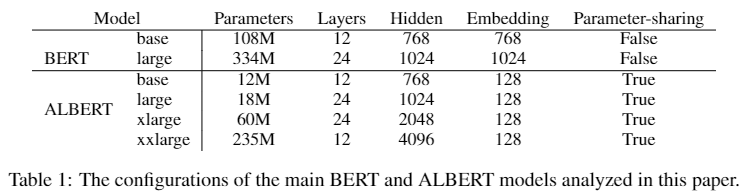

ALBERT-xxlarge configuration with H= 4096 has 233M parameters, i.e., around 70% of BERT-large’s parameters. Note that for ALBERT-xxlarge, we mainly report results on a 12-layer network because a 24-layer network (with the same configuration) obtains similar results but is computationally more expensive.

# 4. Experimental Results
## 4.1 Experimental Setup
To keep the comparison as meaningful as possible, we follow the BERT (Devlin et al., 2019) setup in using the BOOKCORPUS (Zhu et al., 2015) and English Wikipedia (Devlin et al., 2019) for pretraining baseline models. These two corpora consist of around 16GB of uncompressed text. We format our inputs as “\[CLS\] x1 \[SEP\] x2 \[SEP\]”, where x1 = x1,1,x1,2 ···and x2 = x1,1,x1,2 ···are two segments.3 We always limit the maximum input length to 512, and randomly generate input sequences shorter than 512 with a probability of 10%. Like BERT, we use a vocabulary size of 30,000, tokenized using SentencePiece (Kudo & Richardson, 2018) as in XLNet (Yang et al., 2019).

We generate masked inputs for the MLM targets using n-gram masking (Joshi et al., 2019 Spanbert), with the length of each n-gram mask selected randomly. The probability for the length nis given by
$$p(n)=\frac{1 / n}{\sum_{k=1}^{N} 1 / k}$$
We set the maximum length of n-gram (i.e., n) to be 3 (i.e., the MLM target can consist of up to a 3-gram of complete words, such as “White House correspondents”).

All the model updates use a batch size of 4096 and a LAMB optimizer with learning rate 0.00176 (You et al., 2019). We train all models for 125,000 steps unless otherwise specified. Training was done on Cloud TPU V3. The number of TPUs used for training ranged from 64 to 512, depending on model size.

The experimental setup described in this section is used for all of our own versions of BERT as well as ALBERT models, unless otherwise specified.

## 4.2 Evaluation Benchmarks
### 4.2.2 Downstream Evaluation
Following Yang et al. (2019) and Liu et al. (2019), we evaluate our models on three popular benchmarks: The General Language Understanding Evaluation (GLUE) benchmark (Wang et al., 2018), two versions of the Stanford Question Answering Dataset (SQuAD; Rajpurkar et al., 2016; 2018), and the ReAding Comprehension from Examinations (RACE) dataset (Lai et al., 2017). . As in (Liu et al., 2019), we perform early stopping on the development sets, on which we report all comparisons except for our final comparisons based on the task leaderboards, for which we also report test set results. For GLUE datasets that have large variances on the dev set, we report median over 5 runs.

## 4.3 Overall Comparison Between BERT and ALBERT
The improvement in parameter efficiency showcases the most important advantage of ALBERT’s design choices, as shown in Table 2: with only around 70% of BERT-large’s parameters, ALBERT-xxlarge achieves significant improvements over BERT-large, as measured by the difference on development set scores for several representative downstream tasks: SQuAD v1.1 (+1.9%), SQuAD v2.0 (+3.1%), MNLI (+1.4%), SST-2 (+2.2%), and RACE (+8.4%).

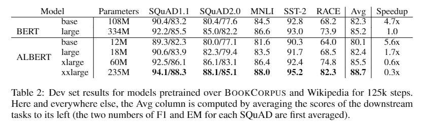

Another interesting observation is the speed of data throughput at training time under the same training configuration (same number of TPUs). Because of less communication and fewer computations, ALBERT models have higher data throughput compared to their corresponding BERT models. If we use BERT-large as the baseline, we observe that ALBERT-large is about 1.7 times faster in iterating through the data while ALBERT-xxlarge is about 3 times slower because of the larger structure.

## 4.4 Factorize Embedding Parametersization
Table 3 shows the effect of changing the vocabulary embedding size Eusing an ALBERT-base configuration setting (see Table 1), using the same set of representative downstream tasks. Under the non-shared condition (BERT-style), larger embedding sizes give better performance, but not by much. Under the all-shared condition (ALBERT-style), an embedding of size 128 appears to be the best. Based on these results, we use an embedding size E= 128 in all future settings, as a necessary step to do further scaling.

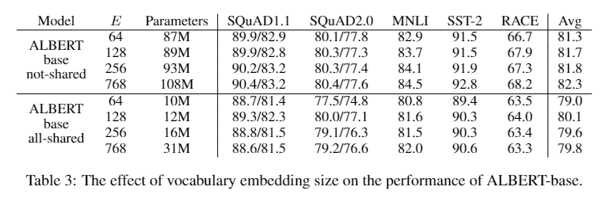

## 4.5 Cross-layer Parameter Sharing
We compare the all-shared strategy (ALBERT-style), the not-shared strategy (BERT-style), and intermediate strategies in which only the attention parameters are shared (but not the FNN ones) or only the FFN parameters are shared (but not the attention ones).

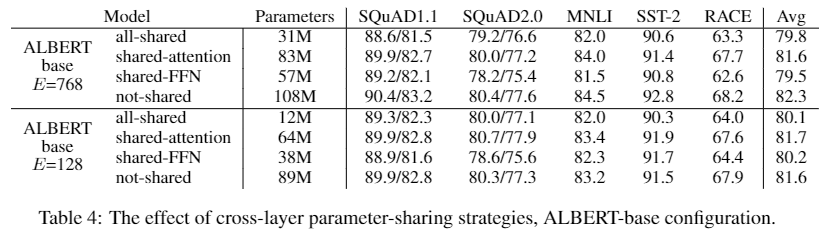

There are other strategies of sharing the parameters cross layers. For example, We can divide the L layers into Ngroups of size M, and each size-Mgroup shares parameters. Overall, our experimental results shows that the smaller the group size Mis, the better the performance we get. However, decreasing group size Malso dramatically increase the number of overall parameters. We choose all-shared strategy as our default choice.

## 4.6 Sentence Order Pridiction(SOP)
We compare head-to-head three experimental conditions for the additional inter-sentence loss: none (XLNet- and RoBERTa-style), NSP (BERT-style), and SOP (ALBERT-style), using an ALBERT-base configuration.

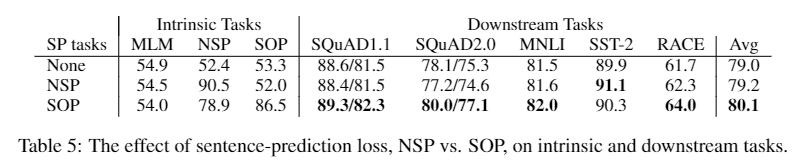

The results on the intrinsic tasks reveal that the NSP loss brings no discriminative power to the SOP task (52.0% accuracy, similar to the random-guess performance for the “None” condition). This allows us to conclude that NSP ends up modeling only topic shift. In contrast, the SOP loss does solve the NSP task relatively well (78.9% accuracy), and the SOP task even better (86.5% accuracy). Even more importantly, the SOP loss appears to consistently improve downstream task performance for multi-sentence encoding tasks (around +1% for SQuAD1.1, +2% for SQuAD2.0, +1.7% for RACE), for an Avg score improvement of around +1%.

## 4.7 What If We Train For The Same Amount Of Time?
The speed-up results in Table 2 indicate that data-throughput for BERT-large is about 3.17x higher compared to ALBERT-xxlarge. Since longer training usually leads to better performance, we perform a comparison in which, instead of controlling for data throughput (number of training steps), we control for the actual training time (i.e., let the models train for the same number of hours). In Table 6, we compare the performance of a BERT-large model after 400k training steps (after 34h of training), roughly equivalent with the amount of time needed to train an ALBERT-xxlarge model with 125k training steps (32h of training)

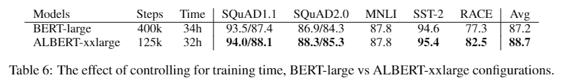

After training for roughly the same amount of time, ALBERT-xxlarge is significantly better than BERT-large: +1.5% better on Avg, with the difference on RACE as high as +5.2%.

## 4.8 Additional Training Data And Dropout Effects
Fig. 2a plots the dev set MLM accuracy under two conditions, without and with additional data, with the latter condition giving a significant boost. We also observe performance improvements on the downstream tasks in Table 7, except for the SQuAD benchmarks (which are Wikipedia-based, and therefore are negatively affected by out-of-domain training material).

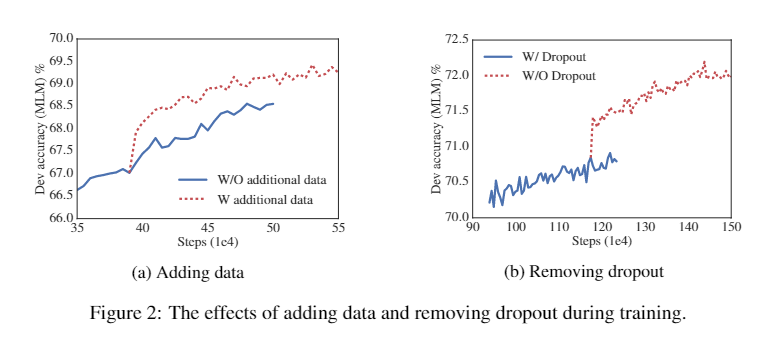

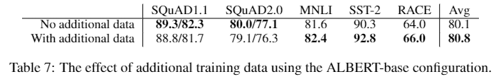

We also note that, even after training for 1M steps, our largest models still do not overfit to their training data. As a result, we decide to remove dropout to further increase our model capacity. The plot in Fig. 2b shows that removing dropout significantly improves MLM accuracy. Intermediate evaluation on ALBERT-xxlarge at around 1M training steps (Table 8) also confirms that removing dropout helps the downstream task.

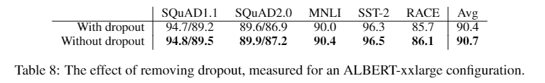

## 4.9 Current State-of-the-art On NLU Tasks
The results we report in this section make use of the training data used by Devlin et al. (2019), as well as the additional data used by Liu et al. (2019) and Yang et al. (2019). We report state-of-the-art results under two settings for fine-tuning: single-model and ensembles. In both settings, we only do single-task fine-tuning4. Following Liu et al. (2019), on the development set we report the median result over five runs.

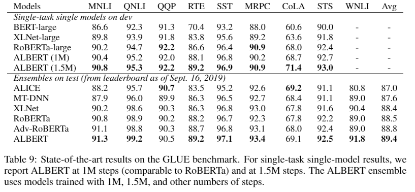

The single-model ALBERT configuration incorporates the best-performing settings discussed: an ALBERT-xxlarge configuration (Table 1) using combined MLM and SOP losses, and no dropout.

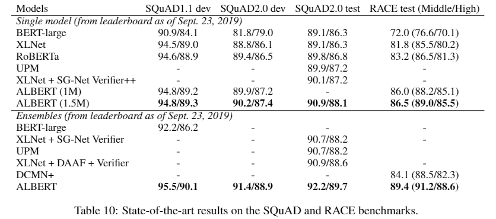

# 5. Discussion
While ALBERT-xxlarge has less parameters than BERT-large and gets significantly better results, it is computationally more expensive due to its larger structure. Additionally, although we have convincing evidence that sentence order prediction is a more consistently-useful learning task that leads to better language representations, we hypothesize that there could be more dimensions not yet captured by the current self-supervised training losses that could create additional representation power for the resulting representations.

# 6. Appendix
**SQuAD is an extractive question answering dataset built from Wikipedia. The answers are segments from the context paragraphs and the task is to predict answer spans. We evaluate our models on two versions of SQuAD: v1.1 and v2.0. SQuAD v1.1 has 100,000 human-annotated question/answer pairs. SQuAD v2.0 additionally introduced 50,000 unanswerable questions. For SQuAD v1.1, we use the same training procedure as BERT, whereas for SQuAD v2.0, models are jointly trained with a span extraction loss and an additional classifier for predicting answerability (Yang et al., 2019; Liu et al., 2019). We report both development set and test set performance.**