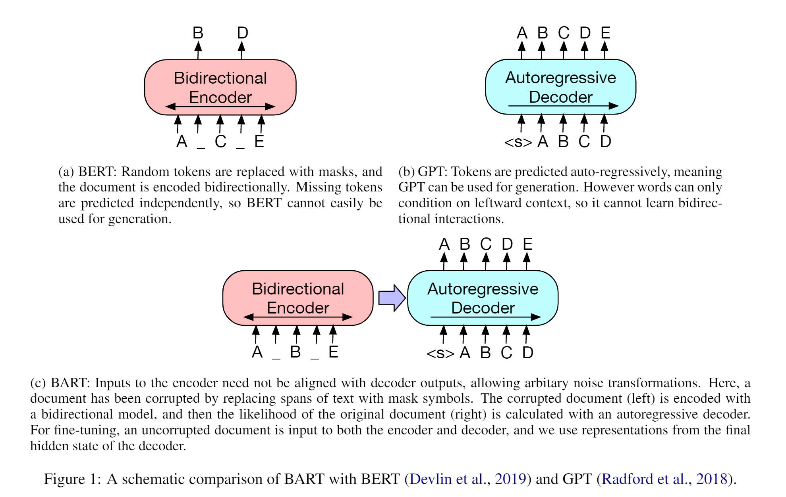
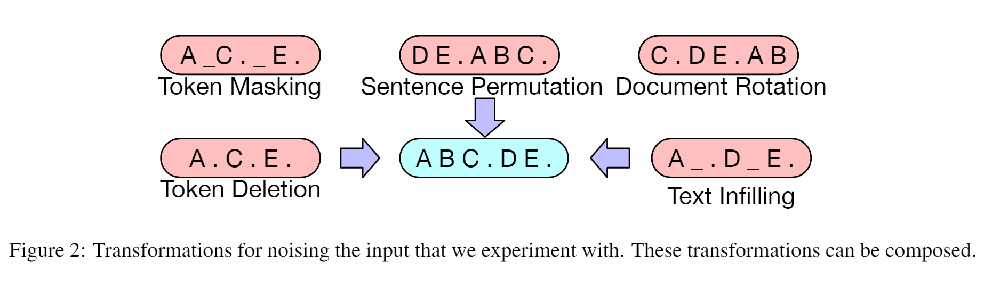
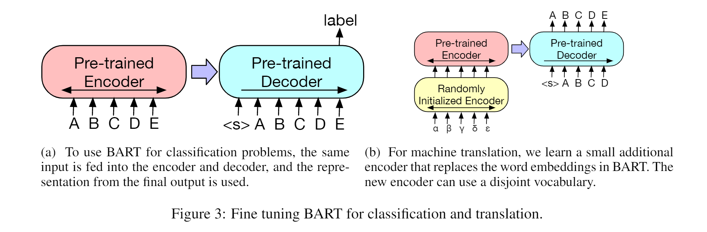
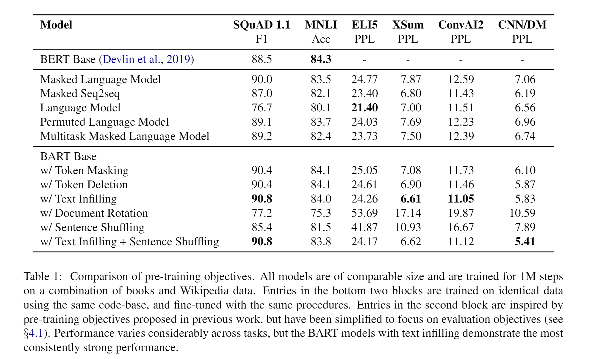
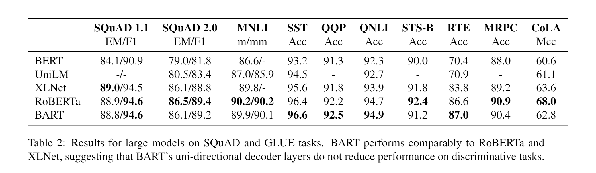
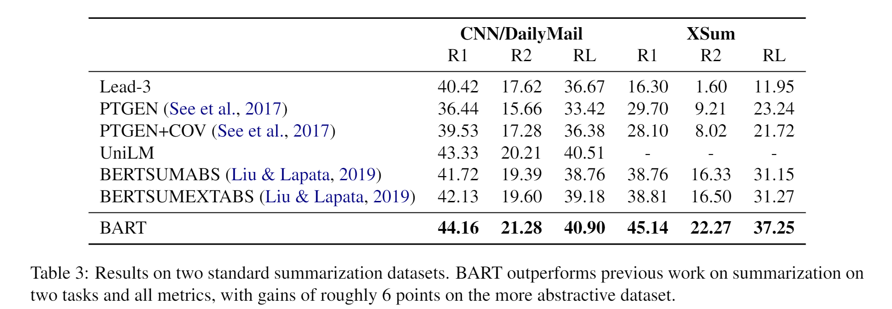
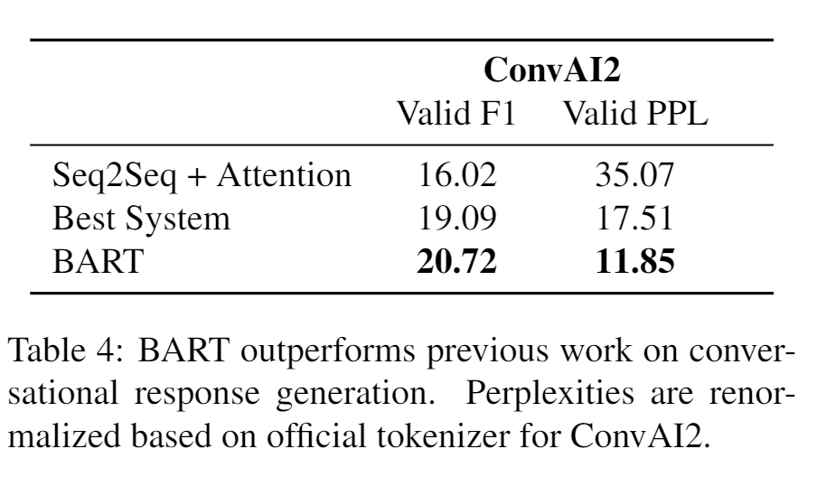
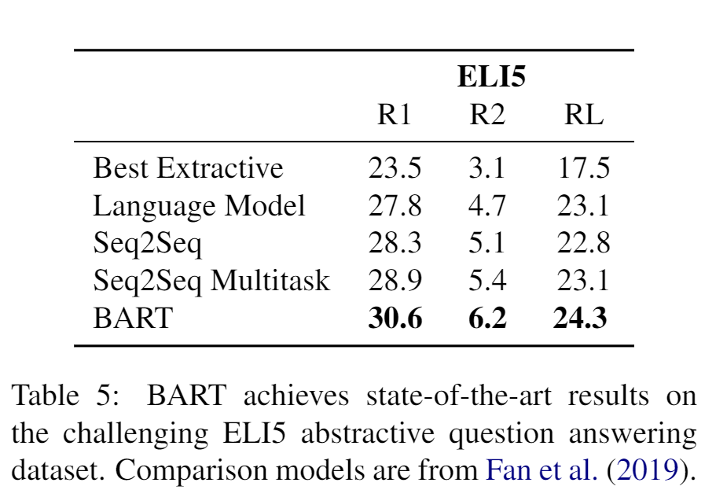
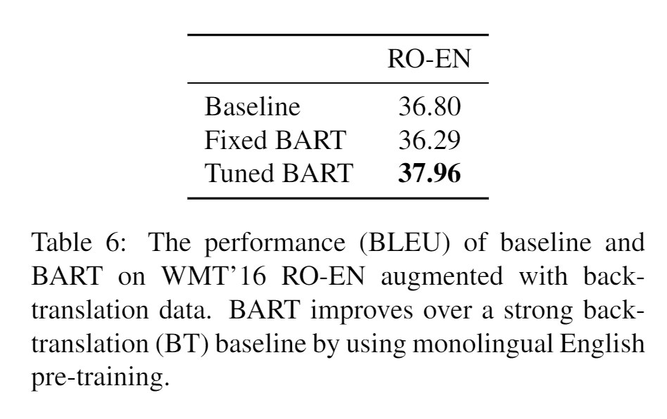

# BART: Denoising Sequence-to-Sequence Pre-training for Natural Language Generation, Translation, and Comprehension
# Abastrct
BART(Bidirectional and Auto-Regressive Transformers)通过任意的加噪方法破坏原始文本，再学习模型重构出原始的文本。作者评估了一系列加噪方法，发现使用一种text infilling方法把原始的文本span替换成mask字符，以及打乱原始句子的顺序效果最好。在GLUE和SQuAD任务上效果和RoBerta相当，并且在摘要、对话、问答等生成式任务上取得了SOTA。
# 1. Introduction
BART是一个去噪的自编码器，预训练包括两步：（1）用任意的加噪方法破坏原始文本（2）学习一个seq2seq模型构造出原始文本。

作者提出了一个新的机器翻译的模式：在BART的Encoder端加几层Transformer结构，用来把外语映射到加噪的英语，再输入到BART，BART作为目标语言端的语言模型。

# 2. Model
## 2.1 Architecture
BART使用了标准的Transformer Encoder-Decoder结构，除了把ReLU激活函数替换成了GeLUs激活函数，并且用$\mathcal{N}(0,0.02)$初始化模型参数。Base模型使用了6层Encoder-Decoder结构，large模型使用了12层。

## 2.2 Pre-training BART
BART首先打乱原始文本，然后优化decoder的输出与原始文本的交叉熵损失。相比于其他的与训练模型有一个明确的加噪模式，BART可以使用任意的加噪模式。

作者实验了不同的扰动策略：
+ **Token Masking**：Bert中把随机的单词替换成\[mask\]
+ **Token Deletion**：随机删除单词
+ **Text Infilling**：使用$\lambda$=3的泊松分布采样span长度，然后把span替换成\[mask\]，如果采样的长度为0，就表示插入一个\[mask\]。与SpanBert不同的是，SpanBert把采样的span替换成相同长度的\[mask\]，但是Text Infilling替换成一个\[mask\]，让模型学习预测出span的长度。
+ **Sentence Permutation**：把文档的句子（以.结束的）打乱成随机的顺序。
+ **Document Rotation**：随机选择一个单词，让文档以这个单词开始。

# 3. Fine-tuning BART
## 3.1 Sequence Classification Tasks
对于序列分类任务，把相同的input喂到encoder和decoder，然后把decoder最后一个token（另加的一个*end* token）输入到分类器做分类。
## 3.2 Token Classification Tasks
对于token分类任务，比如SQuAD，把文档输入到encoder和decoder，然后把decoder端每个token的输出送到分类器做分类。
## 3.3 Sequence Generation Tasks
在序列生成任务中，原始文本做了操作使之与去噪预训练目标相关之后，在decoder端自回归地生成文本。
## 3.4 Machine Translation
在机器翻译任务中，把BART encoder的embedding层替换成一个随机初始化的encoder层。

训练分成两个步骤，每个步骤都反向传播BART解码器端的交叉熵损失。（1）冻结BART的参数，只更新随机初始化的源语言encoder、BART的位置嵌入、BART第一层encoder的self-attention矩阵。（2）用很少的训练步数训练整个模型。

# 4. Comparing Pre-training Objectives
在本节中使用了base模型评估了不同预训练模型的加噪策略（6层768）
## 4.1 Comparison Objectives
+ **Language Model**： GPT中从左到右的Transformer语言模型。

+ **Permuted Language Model**：基于XLNet，采样六分之一的token，然后按照自回归的方式生成，为了和其他模型保持一致，作者没有实现XLNet中的相对位置编码和段间attention。

+ **Masked Language Model**：Bert中的mlm

+ **Multitask Masked Language Model**：UniLM中使用的self-attention mask，self-attention mask按照如下的比例随机选择：1/6 left-to-right, 1/6 right-to-left, 1/3 unmasked, and 1/3 with the first 50% of tokens unmasked and a left-to-right mask for the remainder.

+ **Masked Seq-to-Seq**：由MASS启发，mask掉包含50%的span，然后训练一个seq2seq模型预测mask掉的span。

## 4.2 Tasks
## 4.3 Results

# 5. Large-scale Pre-training Experiments
## 5.1 Experimental Setup
使用了与RoBerta相同的训练数据，12层的encoder和decoder，1024隐藏层大小，和RoBERTa一样8000batch_size，500000训练步数，和GPT2一样的分词算法。

使用了text infilling和sentence permutation：在每个文档中打乱30%的token，并且交换所有sentence的顺序。
## 5.2 Discriminative Tasks

## 5.3 Generation Tasks
+ **Summarization**
+ **Dialogue**
+ **Abstractive QA**

## 5.4 Translation
用了6层的transformer encoder去把罗马语言映射成BART可以处理的加噪英语

# 8. Conclusions
作者提出了BART，用来把打乱的文档映射成原文档的预训练方法，BART在判别式任务上与RoBerta相当，在很多文本生成任务中取得了SOTA.