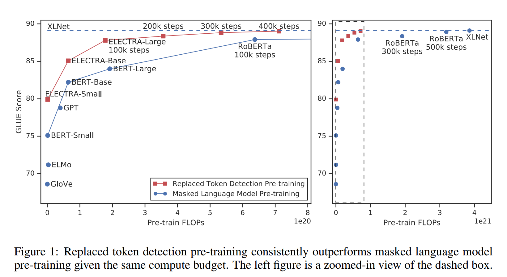
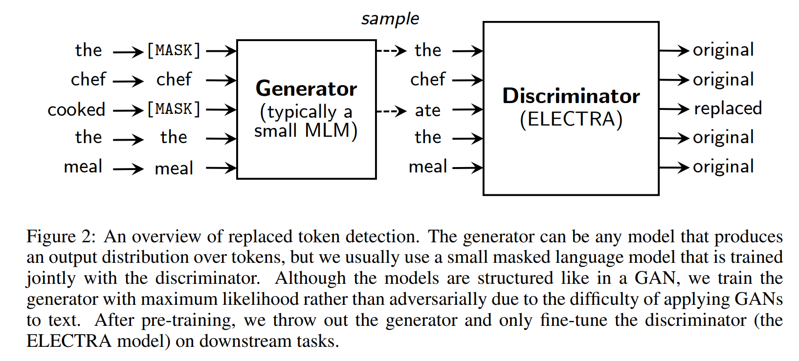
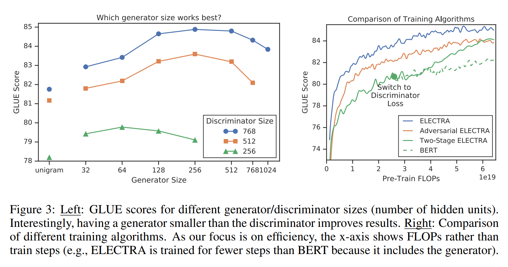
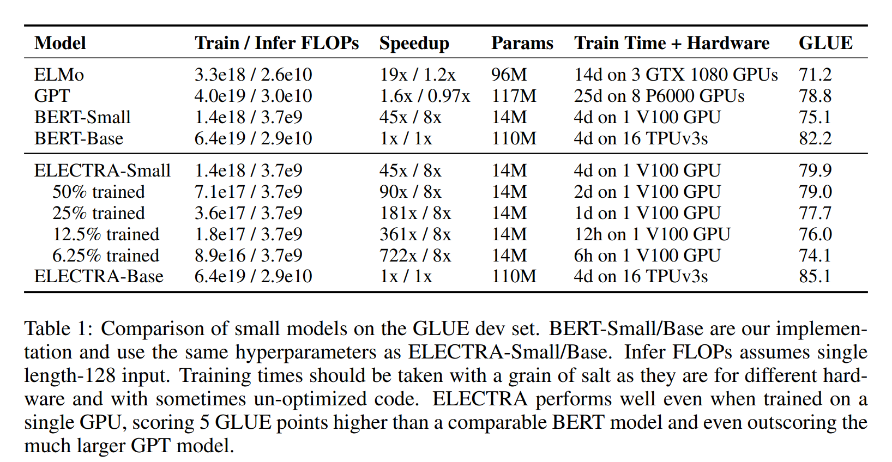
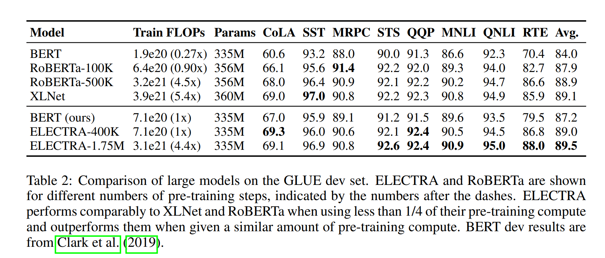
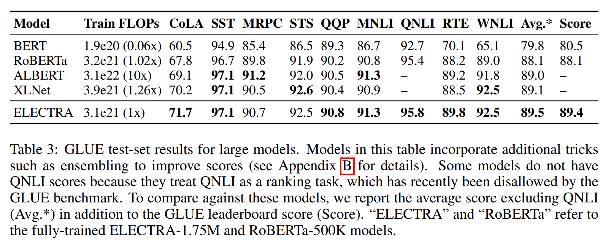
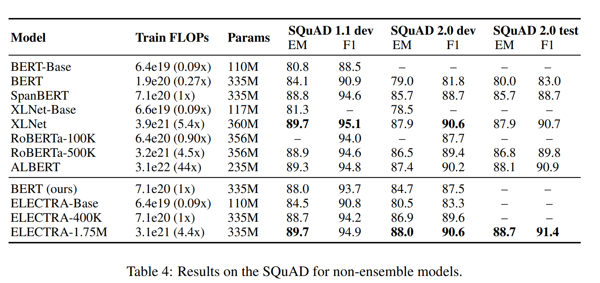

# ELECTRA: PRE-TRAINING TEXT ENCODERS AS DISCRIMINATORS RATHER THAN GENERATORS
# Abstract
We propose a more sample-efficient pre-training task called replaced token detection. Instead of masking the input, our approach corrupts it by replacing some tokens with plausible alternatives sampled from a small generator network. Then, instead of training a model that predicts the original identities of the corrupted tokens, we train a discriminative model that predicts whether each token in the corrupted input was replaced by a generator sample or not. Thorough experiments demonstrate this new pre-training task is more efficient than MLM because the task is defined over all input tokens rather than just the small subset that was masked out. 
# 1. Introduction
Masked language modeling (MLM) approaches incur a substantial compute cost because the network only learns from 15% of the tokens per example.

As an alternative, we propose replaced token detection, a pre-training task in which the model learns to distinguish real input tokens from plausible but synthetically generated replacements. Instead of masking, our method corrupts the input by replacing some tokens with samples from a proposal distribution, which is typically the output of a small masked language model. This corruption procedure solves a mismatch in BERT (although not in XLNet) where the network sees artificial \[MASK\] tokens during pre-training but not when being fine-tuned on downstream tasks. We then pre-train the network as a discriminator that predicts for every token whether it is an original or a replacement.

A key advantage of our discriminative task is that the model learns from all input tokens instead of just the small masked-out subset, making it more computationally efficient.

We call our approach ELECTRA for “Efficiently Learning an Encoder that Classifies Token Replacements Accurately.” Through a series of ablations, we show that learning from all input positions causes ELECTRA to train much faster than BERT. We also show ELECTRA achieves higher accuracy on downstream tasks when fully trained.

We train ELECTRA models of various sizes and evaluate their downstream performance vs. their compute requirement. In particular, we run experiments on the GLUE natural language understanding benchmark (Wang et al., 2019) and SQuAD question answering benchmark (Rajpurkar et al., 2016). ELECTRA substantially outperforms MLM-based methods such as BERT and XLNet given the same model size, data, and compute (see Figure 1).

Our approach also works well at large scale, where we train an ELECTRA-Large model that performs comparably to RoBERTa (Liu et al., 2019) and XLNet (Yang et al., 2019), despite having fewer parameters and using 1/4 of the compute for training. Training ELECTRA-Large further results in an even stronger model that outperforms ALBERT (Lan et al., 2019) on GLUE and sets a new state-of-the-art for SQuAD 2.0. Taken together, our results indicate that the discriminative task of distinguishing real data from challenging negative samples is more compute-efficient and parameter-efficient than existing generative approaches for language representation learning.

# 2. Method

Our approach trains two neural networks, a generator G and a discriminator D. Each one primarily consists of an encoder (e.g., a Transformer network) that maps a sequence on input tokens x = [x1, ..., xn] into a sequence of contextualized vector representations h(x)=[h1, ..., hn]. For a given position t, (in our case only positions where xt = \[MASK\]), the generator outputs a probability for generating a particular token xt with a softmax layer:

$$p_{G}\left(x_{t} \mid \boldsymbol{x}\right)=\exp \left(e\left(x_{t}\right)^{T} h_{G}(\boldsymbol{x})_{t}\right) / \sum \exp \left(e\left(x^{\prime}\right)^{T} h_{G}(\boldsymbol{x})_{t}\right)$$

where e denotes token embeddings. For a given position t, the discriminator predicts whether the token xt is “real,” i.e., that it comes from the data rather than the generator distribution, with a sigmoid output layer:

$$D(\boldsymbol{x}, t)=\operatorname{sigmoid}\left(w^{T} h_{D}(\boldsymbol{x})_{t}\right)$$

The generator is trained to perform masked language modeling (MLM). Given an input x = [x1, x2, ..., xn], MLM first select a random set of positions (integers between 1 and n) to mask out m = \[m1, ..., mk\](Typically k = d0.15ne, i.e., 15% of the tokens are masked out). The tokens in the selected positions are replaced with a \[MASK\] token: we denote this as $x^{masked}$ = REPLACE(x,m, \[MASK\]). The generator then learns to predict the original identities of the masked-out tokens. The discriminator is trained to distinguish tokens in the data from tokens that have been replaced by generator samples. More specifically, we create a corrupted example $x^{corrupt}$ by replacing the masked-out tokens with generator samples and train the discriminator to predict which tokens in $x^{corrupt}$ match the original input x. Formally, model inputs are constructed according to
$$
\begin{array}{ll}
m_{i} \sim \operatorname{unif}\{1, n\} \text { for } i=1 \text { to } k & \boldsymbol{x}^{\text {masked }}=\operatorname{REPLACE}(\boldsymbol{x}, \boldsymbol{m},[\text { MASK }]) \\
\hat{x}_{i} \sim p_{G}\left(x_{i} \mid \boldsymbol{x}^{\text {masked }}\right) \text { for } i \in \boldsymbol{m} & \boldsymbol{x}^{\text {corrupt }}=\operatorname{REPLACE}(\boldsymbol{x}, \boldsymbol{m}, \hat{\boldsymbol{x}})
\end{array}
$$
and the loss functions are:
$$\mathcal{L}_{\mathrm{MLM}}\left(\boldsymbol{x}, \theta_{G}\right)=\mathbb{E}\left(\sum-\log p_{G}\left(x_{i} \mid \boldsymbol{x}^{\text {masked }}\right)\right)$$
$$\mathcal{L}_{\text {Disc }}\left(\boldsymbol{x}, \theta_{D}\right)=\mathbb{E}\left(\sum_{t=1}^{n}-\mathbb{1}\left(x_{t}^{\text {corrupt }}=x_{t}\right) \log D\left(\boldsymbol{x}^{\text {corrupt }}, t\right)-\mathbb{1}\left(x_{t}^{\text {corrupt }} \neq x_{t}\right) \log \left(1-D\left(\boldsymbol{x}^{\text {corrupt }}, t\right)\right)\right)$$
We minimize the combined loss
$$\min _{\theta_{G}, \theta_{D}} \sum_{\boldsymbol{x} \in \mathcal{X}} \mathcal{L}_{\mathrm{MLM}}\left(\boldsymbol{x}, \theta_{G}\right)+\lambda \mathcal{L}_{\text {Disc }}\left(\boldsymbol{x}, \theta_{D}\right)$$
After pre-training, we throw out the generator and fine-tune the discriminator on downstream tasks.

# 3. Experiments
## 3.1 Experimental Setup
We evaluate on the General Language Understanding Evaluation (GLUE) benchmark (Wang et al., 2019) and Stanford Question Answering (SQuAD) dataset (Rajpurkar et al., 2016). 

For most experiments we pre-train on the same data as BERT, which consists of 3.3 Billion tokens from Wikipedia and BooksCorpus (Zhu et al., 2015). However, for our Large model we pre-trained on the data used for XLNet (Yang et al., 2019), which extends the BERT dataset to 33B tokens by including data from ClueWeb (Callan et al., 2009), CommonCrawl, and Gigaword (Parker et al., 2011).

Our model architecture and most hyperparameters are the same as BERT’s. For fine-tuning on GLUE, we add simple linear classifiers on top of ELECTRA. For SQuAD, we add the questionanswering module from XLNet on top of ELECTRA, which is slightly more sophisticated than BERT’s in that it jointly rather than independently predicts the start and end positions and has a “answerability” classifier added for SQuAD 2.0.

## 3.2 Model Extensions
Unless stated otherwise, these experiments use the same model size and training data as BERT-Base.

**Weight Sharing** We propose improving the efficiency of the pre-training by sharing weights between the generator and discriminator. We found it to be more efficient to have a small generator, in which case we only share the embeddings (both the token and positional embeddings) of the generator and discriminator. The “input” and “output” token embeddings of the generator are always tied as in BERT.

We use tied embeddings for further experiments in this paper.

**Smaller Generators** If the generator and discriminator are the same size, training ELECTRA would take around twice as much compute per step as training only with masked language modeling. We suggest using a smaller generator to reduce this factor. Specifically, we make models smaller by decreasing the layer sizes while keeping the other hyperparameters constant. 

GLUE scores for differently-sized generators and discriminators are shown in the left of Figure 3. All models are trained for 500k steps, which puts the smaller generators at a disadvantage in terms of compute because they require less compute per training step. Nevertheless, we find that models work best with generators 1/4-1/2 the size of the discriminator. We speculate that having too strong of a generator may pose a too-challenging task for the discriminator, preventing it from learning as effectively.

**Training Algorithms** The proposed training objective jointly trains the generator and discriminator. We experiment with instead using the following two-stage training procedure:
+ (1) Train only the generator with $\mathcal{L}_{\mathrm{MLM}}$ for n steps.
+ (2) Initialize the weights of the discriminator with the weights of the generator. Then train the discriminator with $\mathcal{L}_{\mathrm{Disc}}$ for n steps, keeping the generator’s weights frozen.

We also explored training the generator adversarially as in a GAN, using reinforcement learning to accommodate the discrete operations of sampling from the generator.

## 3.3 Small Models
As a goal of this work is to improve the efficiency of pre-training, we develop a small model that can be quickly trained on a single GPU. Starting with the BERT-Base hyperparameters, we shortened the sequence length (from 512 to 128), reduced the batch size (from 256 to 128), reduced the model’s hidden dimension size (from 768 to 256), and used smaller token embeddings (from 768 to 128). To provide a fair comparison, we also train a BERT-Small model using the same hyperparameters. We train BERT-Small for 1.5M steps, so it uses the same training FLOPs as ELECTRA-Small, which was trained for 1M steps.We also show results for a base-sized ELECTRA model comparable to BERT-Base.

## 3.4 Large Models

We train big ELECTRA models to measure the effectiveness of the replaced token detection pretraining task at the large scale of current state-of-the-art pre-trained Transformers. Our ELECTRALarge models are the same size as BERT-Large but are trained for much longer. In particular, we train a model for 400k steps (ELECTRA-400K; roughly 1/4 the pre-training compute of RoBERTa) and one for 1.75M steps (ELECTRA-1.75M; similar compute to RoBERTa). We use a batch size 2048 and the XLNet pre-training data. We note that although the XLNet data is similar to the data used to train RoBERTa, the comparison is not entirely direct. As a baseline, we trained our own BERT-Large model using the same hyperparameters and training time as ELECTRA-400K.

Results on the GLUE dev set are shown in Table 2. ELECTRA-400K performs comparably to RoBERTa and XLNet. However, it took less than 1/4 of the compute to train ELECTRA-400K as it did to train RoBERTa and XLNet, demonstrating that ELECTRA’s sample-efficiency gains hold at large scale. Training ELECTRA for longer (ELECTRA-1.75M) results in a model that outscores them on most GLUE tasks while still requiring less pre-training compute.

Results on SQuAD are shown in Table 4. Consistent, with the GLUE results, ELECTRA scores better than masked-language-modeling-based methods given the same compute resources. For example, ELECTRA-400K outperforms RoBERTa-100k and our BERT baseline, which use similar amounts of pre-training compute. ELECTRA-400K also performs comparably to RoBERTa-500K despite using less than 1/4th of the compute. Unsurprisingly, training ELECTRA longer improves results further: ELECTRA-1.75M scores higher than previous models on the SQuAD 2.0 benchmark.

ELECTRA generally performs better at SQuAD 2.0 than 1.1. Perhaps replaced token detection, in which the model distinguishes real tokens from plausible fakes, is particularly transferable to the answerability classification of SQuAD 2.0, in which the model must distinguish answerable questions from fake unanswerable questions.

# 5. Conclusion
We have proposed replaced token detection, a new self-supervised task for language representation learning. The key idea is training a text encoder to distinguish input tokens from high-quality negative samples produced by an small generator network. Compared to masked language modeling, our pre-training objective is more compute-efficient and results in better performance on downstream tasks.