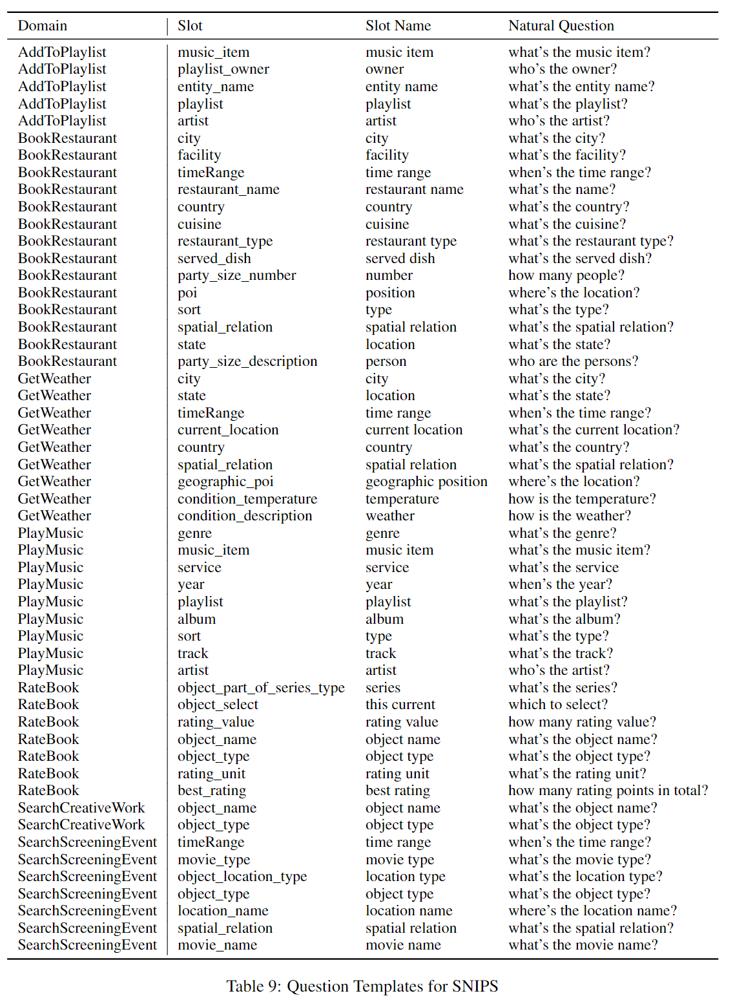

# QA-Driven Zero-shot Slot Filling with Weak Supervision Pretraining
# Abstract
We use a linguistically motivated questioning strategy to turn descriptions into questions, allowing the model to generalize to unseen slot types.Moreover, our QASF model can benefit from weak supervision signals from QA pairs synthetically generated from unlabeled conversation.

# 1. Introduction
Slot descriptions are often ambiguous and typically do not encode enough semantic information by themselves.

Inspired by the recent success of QA-driven approaches (McCann et al., 2018; Logeswaran et al., 2019; Gao et al., 2019; Li et al., 2020; Namazifar et al., 2020), we tackle the slot-filling problem as a reading comprehension task, where each slot type (e.g. “artist”) is associated with a natural language question (e.g. “Who is the artist to play?”).

In this work, we use a linguistically motivated question generation strategy for converting slot descriptions and example values into natural questions, followed by a BERT-based QA model for extracting slot fillers by answering questions.

To the best of our knowledge, we are the first to leverage weakly supervised synthetic QA pairs extracted from unlabeled conversations for a second-stage pretraining. Drawing insights from Mintz et al. (2009), we create a weakly supervised QA dataset from unlabeled conversations and an associated ontology. The synthetic QA pairs are constructed by matching unlabeled utterances against possible slot values in the ontology. This provides a general and cost-effective way to improve QA-based slot filling performance with easily obtainable data.

# 3. Methodology
The framework consists of:
+ (1) a question generation strategy that turns slot descriptions into natural language questions based on linguistic rules; 
+ (2) a generic span-extraction-based question answering model; 
+ (3) an intermediate pretraining stage with generated synthetic QA pairs from unlabeled conversations, which is before task-specific training.

## 3.1 Question Generation Strategy
We design a question generation strategy to turn slot descriptions into natural questions. During this process, a considerable amount of knowledge and semantic information is encoded (Heilman, 2011). A generated question consists of a WH word and a normalized slot description following the template below:

**Generating WH_word** For our spoken language understanding (SLU) tasks, slot fillers are mostly noun phrases2. Therefore, we design a simpler set of conditions based on named entity types and part-of-speech (POS) tags. For each slot type, we sample 10 (utterance, slot value) examples from the validation set. Then we run a NER and a POS tagging model 3 to obtain entity types and POS tags for each of the sampled answer spans. Finally, we select WH_word based on a set of rules described in Table 6 in Appendix.

**Generating slot_description** Instead of directly adding a raw description phrase in the question template, we normalize the phrase with the following simple rule: If the description is of the format “A of B”, where both A and B are noun phrases (NP), we only keep B in the phrase if the WH_word is “How long” or “How many”. Examples of generated questions for corresponding slots are presented in Table 1. 

## 3.2 Question Answering Model
We use BERT (Devlin et al., 2019) as our base
model for jointly encoding the question and utter-
ance. Input sequences for the model share a stan-
dard BERT-style format: *\[CLS\] \<question\> \[SEP\]
\<utterance\> \[SEP\]*

Then the model predicts answer spans with two binary classifiers on top of the BERT outputs $e_{1:M}$. The two classifiers are trained to predict whether each token is the start or the end of an answer span, respectively,

For negative examples, where a question has no answer spans in the utterance, we map the start and end token both to the \[CLS\] token.

At inference time, predicting the slot filler spans is more complex – for each slot type, as there can be *several* or *no* spans to be extracted. After the output layer, we have the probability of each token $x_i$ being the start $(P_s(i))$ and end $(P_e(i))$ of the span.
+ (1) Enumerate all possible combinations of start offset (start) and end offset (end) of the spans ($\frac{M(M-1)}{2}$ candidates in total);
+ (2) Eliminate the spans not satisfying the constraints:
    + start and end token must be within the utterance;
    + the length of the span should be shorter than a maximum length constraint;
    + spans should have a larger probability than the probability of “no answer” (which is represented with \[CLS\] token), namely, $P_{\mathrm{S}}(\text { start })>P_{\mathrm{S}}([\mathrm{CLS}]), P_{\mathrm{e}}(\text { end })>P_{\mathrm{e}}([\mathrm{CLS}])$

We use the uncased version of the BERT-base (Devlin et al., 2019) model for QA finetuning and pretraining.

## 3.3 Pretraining with Weak Supervision
We hypothesize that adding a pretraining step with synthetic QA pairs before fine-tuning can contribute to models’ understanding of interactions between question and utterance.

Previous researches (Wu et al., 2020; Gao et al., 2020) have used crowd-sourced QA pairs, but typically the improvement margin is not significant (Wu et al., 2020) when the task-specific data is in a different domain (SQuAD v.s. newswire).

we draw insights from Mintz et al. (2009) for creating a weakly supervised dataset. Figure 2 illustrates the process. Given an ontology or database of slot types and all possible values for each slot type, we find all utterances containing those value strings in a large set of unlabeled conversations. For example, in Figure 2, for the “hotel_price_range” slot, there are three possible values “expensive”, “cheap” and “moderate” in the ontology. We then form question-answer- utterance triples using the question generation strategy proposed in Section 3.1.

To obtain the pre-defined ontology and unlabeled conversations, we use MultiWOZ 2.2 (Zang et al., 2020), which is an improved version of MultiWOZ (Budzianowski et al., 2018). We do not use annotations in the dataset such as the (changes of) states in the conversations and we treat each utterance independently. We remove slot types that exist in the task-specific training/test data (i.e., SNIPS and TOP) from the ontology and end up with 67,370 QA examples for pretraining.

# 4. Experiments
## 4.1 Datasets and Baselines
**SNIPS** we use this dataset to evaluate zero-shot cross-domain transfer learning.

**TOP** n our setup, we train on all seven domains of SNIPS as well as varying amounts of training data from the TOP training set (0, 20, and 50 examples), and use the TOP test set as an out-of-distribution domain for evaluation. 

We also include a Zero-Shot BERT Tagger (ZSBT) based on BERT (Devlin et al., 2019) as an additional baseline. ZSBT directly encodes raw slot descriptions and utterances and predicts a tag (B, I, or O) for each token in the utterance.

## 4.2 Results and Analysis

### Impact of QG strategy and pretraining
To understand the influence of question generation and impact of pretraining with synthetic QA pairs, we perform ablation studies of both components on the SNIPS dataset. The table below shows ablation results (F-1). “w/o QG” refers to a model trained with *raw* slot descriptions and utterances.

# 5. Conclusion
We propose a QA-driven method with weakly supervised pretraining for zero-shot slot filling. Our experimental results and analyses demonstrate the benefits of QA-formulation, especially in the setting with synthetic QA pairs pretraining.