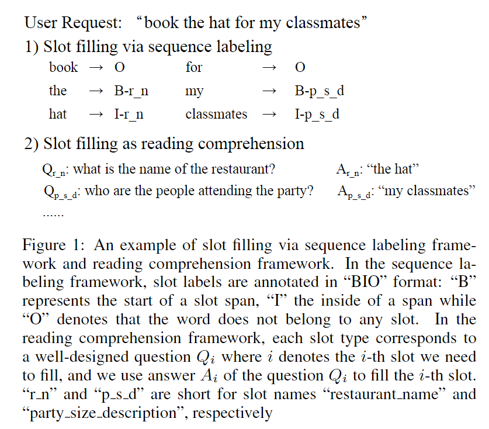
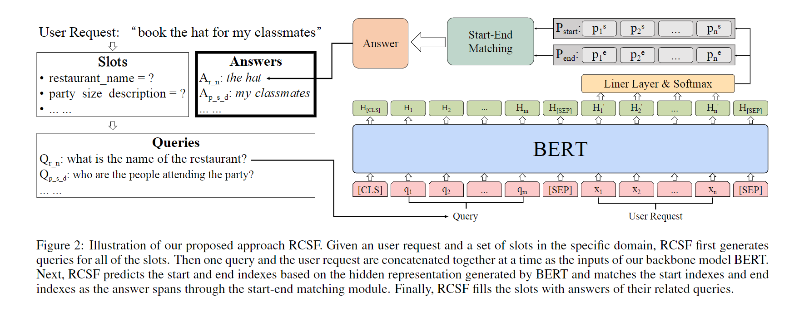
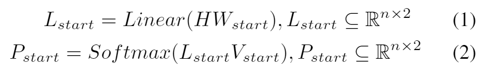
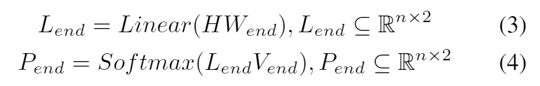
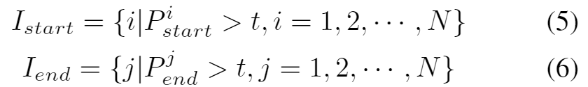
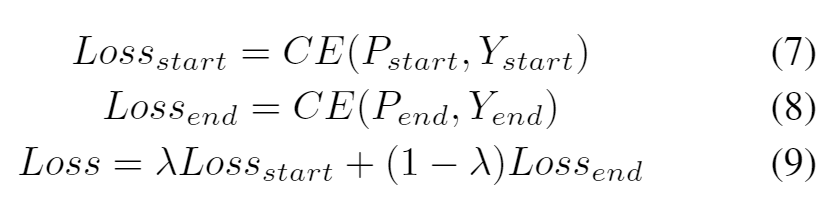
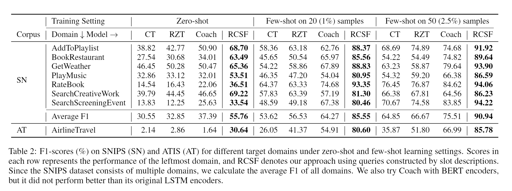
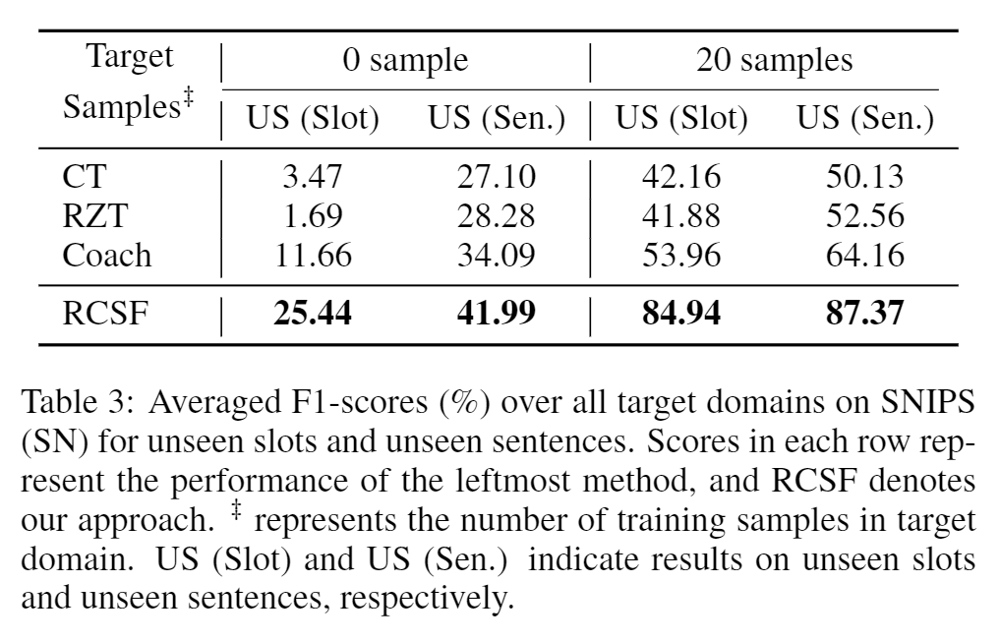
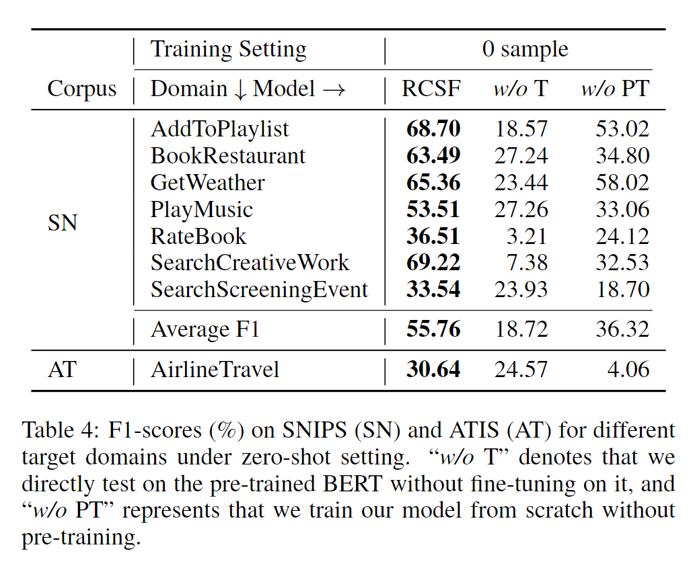
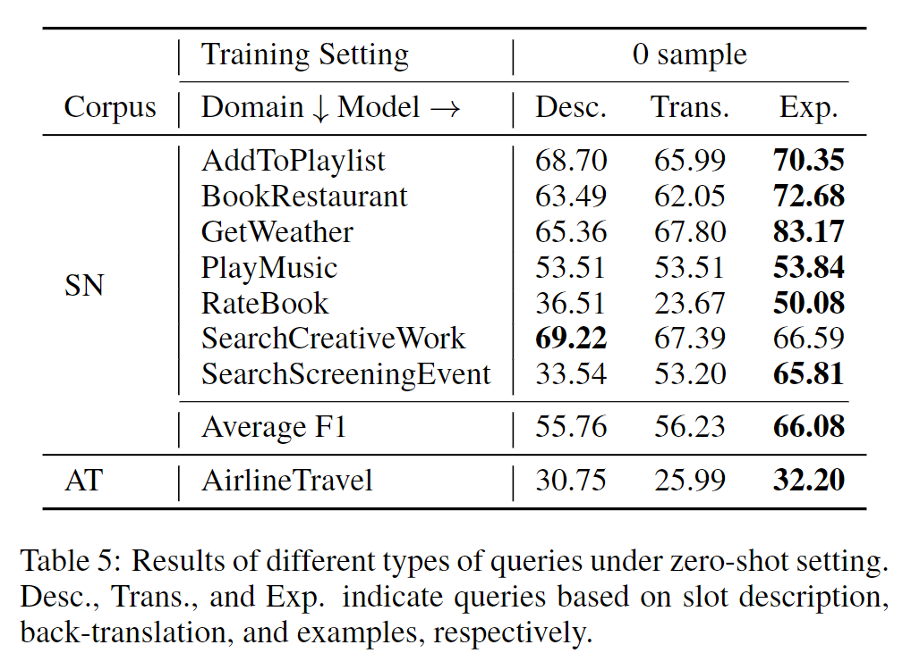

# Cross-Domain Slot Filling as Machine Reading Comprehension
# Abstract
In this paper, we take a new perspective on cross-domain slot filling by framing it as a machine reading comprehension (MRC) problem. Our approach firstly transforms slot names into well-designed queries, which contain rich informative prior knowledge and are very helpful for the detection of domain-specific slots.

# 1. Introduction
Slot filling faces the rapid changing of domains, and few or no target training data may be available in a new domain. To alleviate the data scarcity problem in target domains, we need to train a model that can borrow the prior experience from source domains and adapt it to target domains quickly with limited training samples.

An example of slot filling in the MRC framework is illustrated in Figure 1. We transform each slot type we need to fill into a question, and then fill the slot by answering the question.

In order to boost slot filling in low-resource scenarios, we also leverage the large-scale MRC dataset for pre-training. Compared with the traditional sequence labeling framework, MRC framework has the advantage of introducing prior knowledge about slot information into the queries. More importantly, by converting the sequence labeling problem into MRC problem, we can make full use of large-scale MRC datasets to learn semantic information, which is beneficial for slot filling tasks in the cross-domain setting.

In addition, we also investigate the effect of different query generation strategies and find that adding high-quality slot examples into the queries can further improve the model performance under zero-shot setting.

Compared with previous sequence labeling approaches, our framework can introduce more prior knowledge into the well-designed queries, and thus improve its performance in zero-shot setting. Moreover, by converting slot filling task into MRC task, we are able to utilize the large-scale supervised MRC dataset for pre-training and further improve the performance.

# 2. Related Works
## 2.1 Cross Domain Slot Filling
Slots with similar meanings would have similar descriptions, so it is possible to recognize the unseen slots by training on similar seen slots.

## 2.2 Framing Other NLP Tasks as MRC
Recently, there has been a trend of transforming NLP tasks to MRC problems. For example, [McCann et al., 2018] use the MRC framework to implement ten different NLP tasks uniformly and all achieve competitive performances. [Li et al., 2020] transform named entity recognition (NER) task into MRC to handle the nested NER problem. [Gao etal., 2020] leverage MRC datasets and use MRC techniques to enhance dialogue state tracking task. [Liu et al., 2020a] propose an unsupervised question generation method and utilize a BERT-based question-answering process to bridge MRC and event extraction problem.

Inspired by the great success of MRC, we exploit it to deal with cross-domain slot filling task.  Our work mainly focuses on identifying domain-specific slot entities, which is significantly different from previous work mentioned above.

# 3. Methodology
First of all, RCSF generates a query for each slot with different strategies. Then, the query and the user request are concatenated together as the inputs of the RCSF model (we use BERT as the backbone in this paper). RCSF predicts the start and end indexes based on the hidden representation of BERT. To calculate the final answer, the start indexes and end indexes are matched through the start-end matching module.

## 3.1 Task Formulation
We convert the tagging-style annotated slot filling dataset to a set of $(query, context, answer)$ triples. For each slot type $y \in S_y$ , it is associated with a natural language question (query) $q_y = \{q_{y1}, q_{y2}, ···, q_{ym}\}$ where m denotes the length of the generated question. So slot tagging can be transformed to predicting the answer spans of the specific slot $z_y = [(s_1, e_1), (s_2, e_2), ···, (s_t, e_t)]$ where $s_i$ and $e_i$ denotes the start and the end position of the i-th span, respectively, and $t$ is the number of spans $(1 ≤i ≤t)$.

## 3.2 Query Generation
+ **Description**: We turn slot names into their corresponding slot descriptions by replacing punctuation marks like “ ” and “.” with blanks and replacing abbreviations with their original words. Queries are constructed by filling the above template using the slot descriptions directly.
+ **Back-translation**: The simple conjunction of the template and slot descriptions may introduce extra noises caused by grammar errors. To wipe off the noises, we translate the constructed questions into Chinese and re-translate them back into English 
+ **Example**: The queries are constructed using slot descriptions and two slot examples from the training and validation datasets. We use the template *“what is the slot description like example 1 or example 2?”*.

## 3.3 Slot Filling as Answer Prediction
BERT receives the input sequence and generates a context representation matrix $H \subset \mathbb{R}^{n \times d}$, where $d$ is the dimension of the last layer of BERT.

### Start and End Prediction
In the traditional MRC framework, one query usually has one answer. However, in our approach, one query may correspond to multiple answers. Therefore, we construct two binary classifiers. One is used to predict whether the token is a start index, and the other is employed to predict whether the token is an end index. Given the representation matrix $H$ output by BERT, the model first predicts the probability $P_{start}$ of each token being a start index as follows:

And the end index prediction procedure is exactly the same, except that we have other matrix $W_{end}$ and $V_{end}$ to obtain the probability matrix $P_{end}$ of each token being an end index:

### Start-End Matching
In the context $X$, there can be multiple entities of the same category, which means we are supposed to predict multiple start-end pairs.

We adopt the principle of the most possible pair first. That is, we first sort the start indexes and end indexes by their probability $P_{start}$ and $P_{end}$. Then we choose the top-$N$ start indexes and the top-$N$ end indexes, where N is a predefined number:

With the sets of the most possible start indexes $I_{start}$ and end indexes $I_{end}$, we calculate the probability $P^{ij}$ of each start-end pair by adding $P^i_{start}$ and $P^j_{end}$ where $P^i_{start}$ denotes the probability of the i-th token being a start token and $P^j_{end}$ denotes the j-th token being an end token. Then, we sort the matched start-end pairs by $P^{ij}$ and choose the most possible pair which does not overlap the chosen ones.

## 3.4 Train and Test
To utilize the large-scale MRC dataset, we adopt a two-stage training procedure. Our MRC model is first pre-trained on the MRC dataset SQuAD2.0 [Rajpurkar et al., 2018], and then fine-tuned on queries and answers created from our slot filling datasets.

At test time, first of all, start and end indexes are separately selected based on Eq. 5 and Eq. 6. Then the start-end matching module is applied to align the extracted start indexes and the end indexes, leading to the final extracted answers.

# 4. Experiments
## 4.1 Experimental Settings
We evaluate our framework on SNIPS [Coucke et al., 2018], a public spoken language understanding dataset which contains 39 slot types across seven domains (intents) and about 2000 samples per domain. To simulate the cross-domain scenarios, we follow [Liu et al., 2020b] to split the dataset, that is, we choose one domain as the target domain and the other six domains as the source domains each time.

However, domains in SNIPS are not completely independent with each other. We use another commonly used dataset ATIS [Hemphill et al., 1990] as target domain to test our model. It consists of 5971 utterances related to the airline travel domain with 83 slot types.

## 4.2 Main Results and Discussions

### Analysis on Unseen Slots and Unseen Sentences
However, [Liu et al., 2020b] can not show the real zero-shot scenarios directly because a sample with both seen slots and unseen slots would be categorized into “unseen sentence” part in their experiments. Therefore, we recalculate the F1-scores for each slot separately instead of each sentence. In our experiments, if a slot does not exist in the remaining six source domains, it will be categorized into the “unseen slot” part. Otherwise we categorize it into the “seen slot” part.

## 4.3 Ablation Studies
### The Effect of the BERT Pre-training
Firstly, we directly test the pre-trained BERT model on the test dataset without fine-tuning it on our training dataset. It can be seen that we still get an average F1 of 18.72% on SNIPS and 24.57% on ATIS, which shows that the pre-trained BERT does contain rich semantic information and our model fully utilize it to boost performance.

Secondly, to separate the effect of the pre-training, we train the model with randomly initialized weights. Without pre-training, the performance of our MRC model drops drastically, but it still slightly outperforms the existing state-of-the-art model which adopts sequence labeling framework in low-resource scenarios. This suggests that the MRC framework is more data-efficient than sequence labeling methods.

### The Effect of Query Construction Strategies
Intuitively, the more in formation the query contains, the better its effect should be. Table 5 shows the performance of different types of queries under zero-shot setting. It can be seen that using slot descriptions and slot examples together is superior to the other two methods on average, since more information can be found in slot examples, which is in line with our intuition.

# 5. Conclusion and Future Work
In the future, we would like to explore how to jointly address intent detection and slot filling tasks using a unified MRC framework in cross-domain scenarios