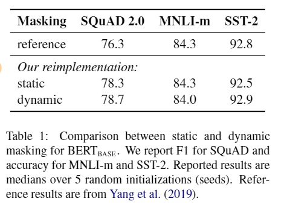
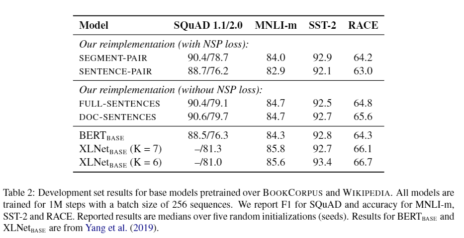
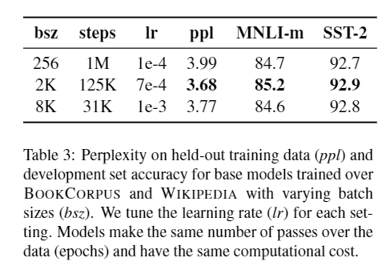
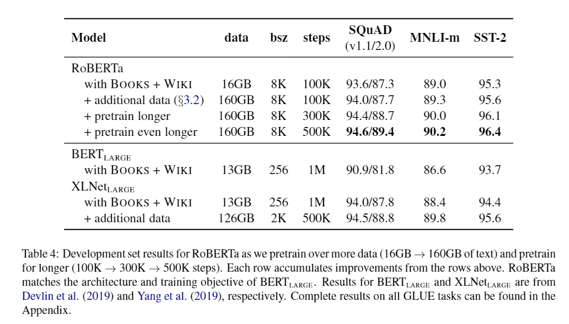
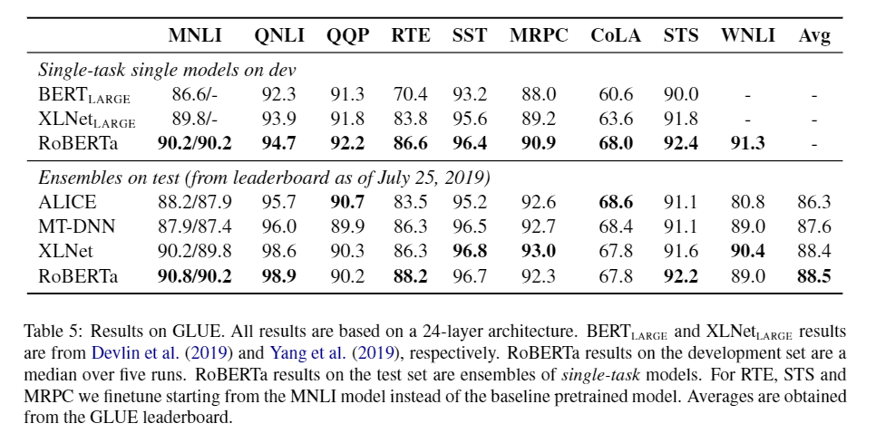
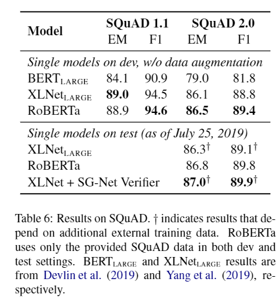
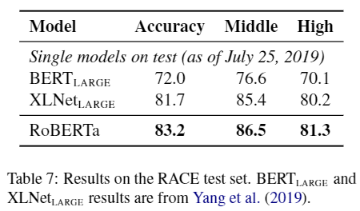

# RoBERTa: A Robustly Optimized BERT Pretraining Approach
# Abstract
We present a replication study of BERT pretraining (Devlin et al., 2019) that carefully measures the impact of many key hyperparameters and training data size.We find that BERT was significantly undertrained, and can match or exceed the performance of every model published after it. Our best model achieves state-of-the-art results on GLUE, RACE and SQuAD.
# 1. Introduction
We find that BERT was significantly undertrained and propose an improved recipe for training BERT models, which we call RoBERTa, that can match or exceed the performance of all of the post-BERT methods. Our modifications are simple, they include: 
+ (1) training the model longer, with bigger batches, over more data; 
+ (2) removing the next sentence prediction objective; 
+ (3) training on longer sequences;
+ (4) dynamically changing the masking pattern applied to the training data. 

We also collect a large new dataset (CC-NEWS) of comparable size to other privately used datasets, to better control for training set size effects.

In summary, the contributions of this paper are:
+ (1) We present a set of important BERT design choices and training strategies and introduce alternatives that lead to better downstream task performance;
+ (2) We use a novel dataset, CC-NEWS, and confirm that using more data for pre-training further improves performance on downstream tasks;
+ (3) Our training improvements show that masked language model pretraining, under the right design choices, is competitive with all
other recently published methods.
# 2. Background
BERT is trained on a combination of BOOKCORPUS (Zhu et al., 2015) plus English WIKIPEDIA, which totals 16GB of uncompressed text.
# 3. Experimental Setup
## 3.2 Data
For our study, we focus on gathering as much data as possible for experimentation, allowing us to match the overall quality and quantity of data as appropriate for each comparison.

We consider five English-language corpora of varying sizes and domains, totaling over 160GB of uncompressed text:
+ BOOKCORPUS (Zhu et al., 2015) plus English WIKIPEDIA. This is the original data used to train BERT. (16GB).
+ CC-NEWS, which we collected from the English portion of the CommonCrawl News dataset (Nagel, 2016). The data contains 63 million English news articles crawled between September 2016 and February 2019. (76GB after filtering).
+ OPENWEBTEXT (Gokaslan and Cohen, 2019), an open-source recreation of the WebText corpus described in Radford et al. (2019). The text is web content extracted from URLs shared on Reddit with at least three upvotes. (38GB).
+ STORIES, a dataset introduced in Trinh and Le (2018) containing a  subset of CommonCrawl data filtered to match the story-like style of
Winograd schemas. (31GB).
## 3.3 Evaluation
Following previous work, we evaluate our pre-trained models on downstream tasks using the following three benchmarks.

**GLUE** The General Language Understanding Evaluation (GLUE) benchmark (Wang et al., 2019b) is a collection of 9 datasets for evaluating  natural language understanding systems.6 Tasks are framed as either single-sentence classification or sentence-pair classification tasks. The GLUE organizers provide training and development data splits as well as a submission server and leaderboard that allows participants to evaluate and compare their systems on private held-out test data.

**SQuDA** The Stanford Question Answering Dataset (SQuAD) provides a paragraph of context and a question. The task is to answer the question
by extracting the relevant span from the context. We evaluate on two versions of SQuAD: V1.1 and V2.0 (Rajpurkar et al., 2016, 2018). In V1.1
the context always contains an answer, whereas in V2.0 some questions are not answered in the provided context, making the task more challenging.

**For SQuAD V1.1 we adopt the same span prediction method as BERT (Devlin et al., 2019). For SQuAD V2.0, we add an additional binary classifier to predict whether the question is answerable, which we train jointly by summing the classification and span loss terms. During evaluation, we only predict span indices on pairs that are classi fied as answerable.**

**RACE** The ReAding Comprehension from Examinations (RACE) (Lai et al., 2017) task is a large-scale reading comprehension dataset with more than 28,000 passages and nearly 100,000 questions. The dataset is collected from English examinations in China, which are designed for
middle and high school students. In RACE, each passage is associated with multiple questions. For every question, the task is to select one correct answer from four options. RACE has significantly longer context than other popular reading comprehension datasets and the proportion of questions that requires reasoning is very large.

# 4. Training Procedure Analysis
This section explores and quantifies which choices are important for successfully pretraining BERT models. We keep the model architecture fixed. Specifically, we begin by training BERT models with the same configuration as $BERT_{BASE}$ (L=12, H= 768 , A= 12 , 110M params).

## 4.1 Static vs. Dynamic Masking
The original BERT implementation performed masking once during data preprocessing, resulting in a single static mask. To avoid using the same mask for each training instance in every epoch, training data was duplicated 10 times so that each sequence is masked in 10 different ways over the 40 epochs of training. Thus, each training sequence was seen with the same mask four times during training.

We compare this strategy with *dynamic masking* where we generate the masking pattern every time we feed a sequence to the model. This becomes crucial when pretraining for more steps or with larger datasets.

Given these results and the additional efficiency benefits of dynamic masking, we use dynamic masking in the remainder of the experiments.

## 4.2 Model Input Format and Next Sentence Prediction
The NSP loss was hypothesized to be an important factor in training the original BERT model. Devlin et al. (2019)(bert) observe that removing NSP hurts performance, with significant performance degradation on QNLI, MNLI, and SQuAD 1.1. However, some recent work has questioned the
necessity of the NSP loss (Lample and Conneau, 2019; Yang et al., 2019(xlnet); Joshi et al., 2019(spanbert)).

To better understand this discrepancy, we compare several alternative training formats:
+ **SEGMENT-PAIR+NSP:** This follows the original input format used in BERT (Devlin et al., 2019), with the NSP loss. Each input has a pair of segments, which can each contain multiple natural sentences.

+ **SENTENCE-PAIR+NSP:** Each input contains a pair of natural sentences, either sampled from a contiguous portion of one document or from separate documents. Since these inputs are significantly shorter than 512 tokens, we increase the batch size so that the total number of tokens remains similar to SEGMENT-PAIR+NSP. We retain the NSP loss.

+ **FULL-SENTENCES:** When we reach the end of one document, we begin sampling sentences from the next document and add an extra separator token between documents. We remove the NSP loss.

+ **DOC-SENTENCES:** nputs are constructed similarly to FULL-SENTENCES, except that they may not cross document boundaries. Inputs sampled near the end of a document may be shorter than 512 tokens, so we dynamically increase the batch size in these cases to achieve a similar number of total tokens as FULL-SENTENCES.

**Result** We find that using individual sentences hurts performance on downstream tasks, which we hypothesize is because the model  is not able to learn long-range dependencies.

We find that this setting outperforms the originally published $BERT_{BASE}$ results and that removing the NSP loss matches or slightly improves downstream task performance, in contrast to Devlin et al. (2019)(bert). It is possible that the original BERT implementation may only have removed the loss term while still retaining the SEGMENT-PAIR input format.

Finally we find that restricting sequences to come from a single document (DOC-SENTENCES) performs slightly better than packing sequences from multiple documents (FULL-SENTENCES). However, because the DOC-SENTENCES format results in variable batch sizes, we use FULL- SENTENCES in the remainder of our experiments for easier comparison with related work.

## 4.3 Training with large batches
Past work in Neural Machine Translation has shown that training with very large mini-batches can both improve optimization speed and end-task performance when the learning rate is increased appropriately.

Devlin et al. (2019) originally trained $BERT_{BASE}$ for 1M steps with a batch size of 256 sequences. This is equivalent in computational cost, via gradient accumulation, to training for 125K steps with a batch size of 2K sequences, or for 31K steps with a batch size of 8K.

In Table 3 we compare perplexity and end-task performance of $BERT_{BASE}$ as we increase the batch size, controlling for the number of passes through the training data. We observe that training with large batches improves perplexity for the masked language modeling objective, as well as end-task accuracy.

in later experiments we train with batches of 8K sequences.

## 4.4 Text Encoding
Byte-Pair Encoding (BPE) (Sennrich et al., 2016) is a hybrid between character- and word-level resentations that allows handling the large vocabularies common in natural language corpora.

Radford et al. (2019)(GPT2) introduce a clever implementation of BPE that uses bytes instead of unicode characters as the base subword units. Using bytes makes it possible to learn a subword vocabulary of a modest size (50K units) that can still encode any input text without introducing any “unknown” tokens.

The original BERT implementation (Devlin et al., 2019) uses a character-level BPE vocabulary of size 30K, which is learned after preprocessing the input with heuristic tokenization rules. Following Radford et al. (2019), we instead consider training BERT with a larger byte-level BPE vocabulary containing 50K subword units, without any additional preprocessing or tokenization of the input. This adds approximately 15M and 20M additional parameters for BERTBASE and BERTLARGE, respectively. 

# 5. RoBERTa
In the previous section we propose modifications to the BERT pretraining procedure that improve end-task performance. We now aggregate these improvements and evaluate their combined impact. We call this configuration RoBERTa for Robustly optimized BERT approach. Specifically, RoBERTa is trained with dynamic masking (Section 4.1), FULL-SENTENCES without NSP loss (Section 4.2), large mini-batches (Section 4.3) and a larger byte-level BPE (Section 4.4).

Additionally, we investigate two other important factors that have been under-emphasized in previous work: (1) the data used for pretraining, and (2) the number of training passes through the data.

To help disentangle the importance of these factors from other modeling choices (e.g., the pre-training objective), we begin by training RoBERTa following the BERTLARGE architecture (L= 24 , H= 1024 , A= 16 , 355M parameters). We pretrain for 100K steps over a comparable BOOKCORPUS plus WIKIPEDIA dataset as was used in Devlin et al. (2019). We pretrain our model using 1024 V100 GPUs for approximately one day.

**Results**  We present our results in Table 4. When controlling for training data, we observe that RoBERTa provides a large improvement over the originally reported BERTLARGE results, reaffirming the importance of the design choices we explored in Section 4.

Finally, we pretrain RoBERTa for significantly longer, increasing the number of pretraining steps from 100K to 300K, and then further to 500K. We again observe significant gains in downstream task performance, and the 300K and 500K step models outperform XLNetLARGE across most tasks.

In the rest of the paper, we evaluate our best RoBERTa model on the three different benchmarks: GLUE, SQuaD and RACE. Specifically we consider RoBERTa trained for 500K steps overall five of the datasets introduced in Section 3.2.

## 5.1 GLUE Results
For GLUE we consider two finetuning settings. In the first setting (single-task, dev) we finetune  RoBERTa separately for each of the GLUE tasks, using only the training data for the corresponding task. We consider a limited hyperparameter sweep for each task, with batch sizes ∈{16,32} and learning rates ∈{1e−5,2e−5,3e−5}, with a linear warmup for the first 6% of steps followed by a linear decay to 0. We finetune for 10 epochs and perform early stopping based on each task’s evaluation metric on the dev set. The rest of the hyperparameters remain the same as during pretraining. In this setting, we report the median development set results for each task over five random initializations, without model ensembling.

In the second setting (ensembles, test), we compare RoBERTa to other approaches on the test set via the GLUE leaderboard. While many submissions to the GLUE leaderboard depend on multi-task finetuning, our submission depends only on single-task finetuning. For RTE, STS and MRPC we found it helpful to finetune starting from the MNLI single-task model, rather than the baseline pretrained RoBERTa.

**Results** We present our results in Table 5. In the first setting (single-task, dev), RoBERTa achieves state-of-the-art results on all 9 of the GLUE task development sets. Crucially, RoBERTa uses the same masked language modeling pretraining objective and architecture as BERTLARGE, yet consistently outperforms both BERTLARGE and XLNetLARGE. This raises questions about the relative importance of model architecture and pre-training objective, compared to more mundane details like dataset size and training time that we explore in this work.

In the second setting (ensembles, test), we submit RoBERTa to the GLUE leaderboard and achieve state-of-the-art results on 4 out of 9 tasks and the highest average score to date. This is especially exciting because RoBERTa does not depend on multi-task finetuning, unlike most of the other top submissions.

## 5.2 SQuAD Results

**For SQuAD v1.1 we follow the same finetuning procedure as Devlin et al. (2019). For SQuADv2.0, we additionally classify whether a given question is answerable; we train this classifier jointly with the span predictor by summing the classification and span loss terms.**

## 5.3 RACE Results

In RACE, systems are provided with a passage of text, an associated question, and four candidate answers. Systems are required to classify which of the four candidate answers is correct.

We modify RoBERTa for this task by concatenating each candidate answer with the corresponding question and passage. We then encode each of these four sequences and pass the resulting \[CLS\] representations through a fully-connected layer, which is used to predict the correct answer. We truncate question-answer pairs that are longer than 128 tokens and, if needed, the passage so that the total length is at most 512 tokens.

# 7. Conclusion

We carefully evaluate a number of design decisions when pretraining BERT models. We find that performance can be substantially improved by training the model longer, with bigger batches over more data; removing the next sentence prediction objective; training on longer sequences; and dynamically changing the masking pattern applied to the training data. Our improved pretraining procedure, which we call RoBERTa, achieves state-of-the-art results on GLUE, RACE and SQuAD, without multi-task finetuning for GLUE or additional data for SQuAD. These results illustrate the importance of these previously overlooked design decisions and suggest that BERT’s pretraining objective remains competitive with recently proposed alternatives.