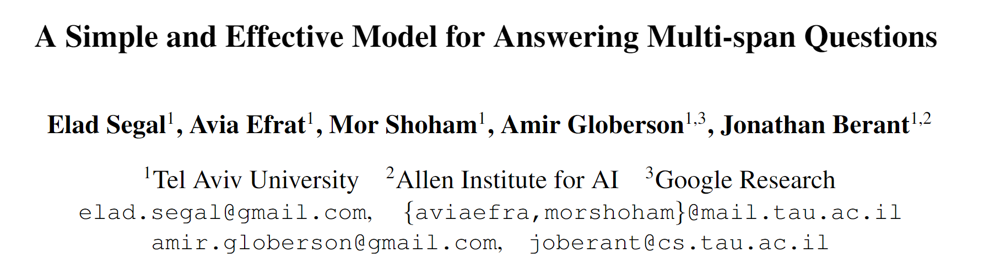
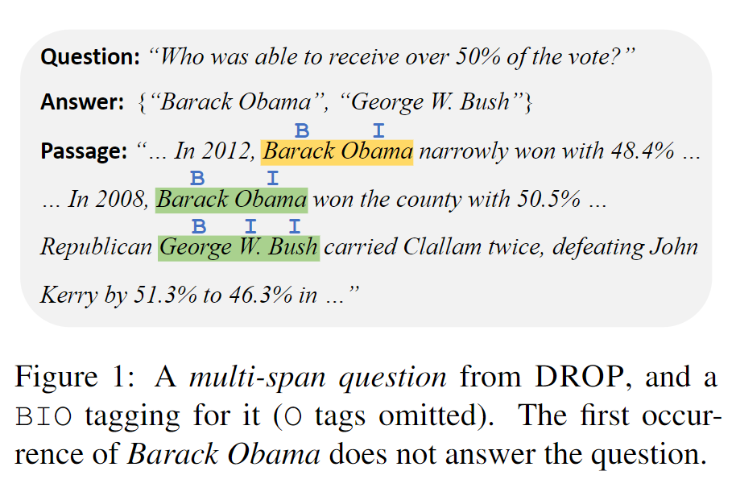
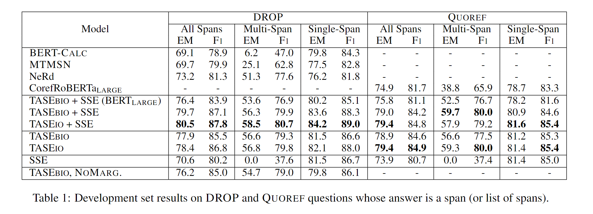
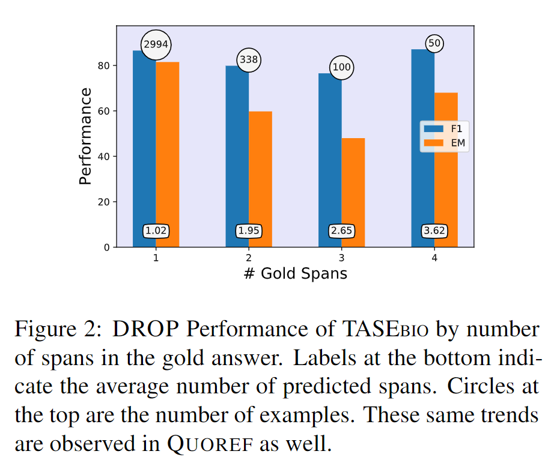

# 1. 研究动机
很多mrc模型研究的是single-span的问题，然而很多数据集都包含了multi-span的问题，即一个问题的答案是很多个不连续的span(不是单独的一个span)。作者提出了一个简单的架构解决回答multi-span的question：把mrc任务建模成序列标注任务，即预测每一个token是不是一个output的一部分。

# 2. 方法
## 2.1 Single-Span Model
给question-context-answer三元组$\left(q_{i}, c_{i}, a_{i}\right)_{i=1}^{N}$，使用一个预训练模型比如BERTD得到文本表示$h$，$\boldsymbol{h}=\operatorname{Encoder}([q, c])$，其中$\boldsymbol{h}=\left(\boldsymbol{h}_{1}, \ldots, \boldsymbol{h}_{m}\right)$是所有输入的向量表示。

然后计算每一个token是answer开始位置和结束位置的分数$f_{\text {start }}\left(\boldsymbol{h}_{i}\right)$和$f_{\text {end }}\left(\boldsymbol{h}_{i}\right)$，然后softmax得到概率：
$$\boldsymbol{p}_{i}^{\text {start }}=\operatorname{softmax}\left(f_{\text {start }}\left(\boldsymbol{h}_{1}\right), \ldots, f_{\text {start }}\left(\boldsymbol{h}_{m}\right)\right)_{i}$$
$$\boldsymbol{p}_{i}^{\text {end }}=\operatorname{softmax}\left(f_{\text {end }}\left(\boldsymbol{h}_{1}\right), \ldots, f_{\text {end }}\left(\boldsymbol{h}_{m}\right)\right)_{i}$$
最后提取出预测的span：
$$(s, e)=\underset{s \leq e}{\arg \max } \boldsymbol{p}_{s}^{\text {start }} \boldsymbol{p}_{e}^{\text {end }}$$

## 2.2 Multi-Span Model
作者把Multi-Span的question建模成序列标注任务，并且使用了两种标注模式：$BIO$模式和$IO$模式，其中$IO$模式中如果一个token在answer-span里就是I，否则是O，然后预测每一个单词的概率：
$$\boldsymbol{p}_{i}=\operatorname{softmax}\left(f\left(\boldsymbol{h}_{i}\right)\right)$$

## 2.3 训练
有一个问题是，同一个answer-span可能在输入中出现很多次（如图1），即一个输入'X Y Z Y Z'，正确的label是{X, Z}，这个时候就有多种序列标注的可能：B O B O B或者B O B O O或者B O O O B。

对于这个问题，作者枚举所有可能的标注方式$\mathcal{T}$，然后训练模型最大化如下的边缘概率：
$$\log p(\mathcal{T} \mid \boldsymbol{h})=\log \sum_{\boldsymbol{T} \in \mathcal{T}}\left(\prod_{i=1}^{m} \boldsymbol{p}_{i}\left[\boldsymbol{T}_{i}\right]\right)$$

## 2.4 解码
$BIO$模式用维特比解码，$IO$模式用贪心解码。

## 2.5 Multi-Head Model
使用Multi-Head的架构，每一个head $z$是一个独立的模块，$p_{z}(a \mid q, c)=p_{z}(a \mid \boldsymbol{h})$，训练一个额外的模块选择使用哪一个头：$p_{\text {head }}(z \mid q, c)=p_{\text {head }}(z \mid \boldsymbol{h})$，最终模型输出的answer的概率如下：
$$p(a \mid q, c)=\sum_{z} p_{\text {head }}(z \mid q, c) \cdot p_{z}(a \mid q, c)$$

使用这种multi-head架构，作者使用了一个single-span model的头、一个multi-span model的头，动态地决定使用哪种span提取方法。

# 3. 实验
**TASE**: TAg-based Span Extraction

**SSE**: single-span extraction

